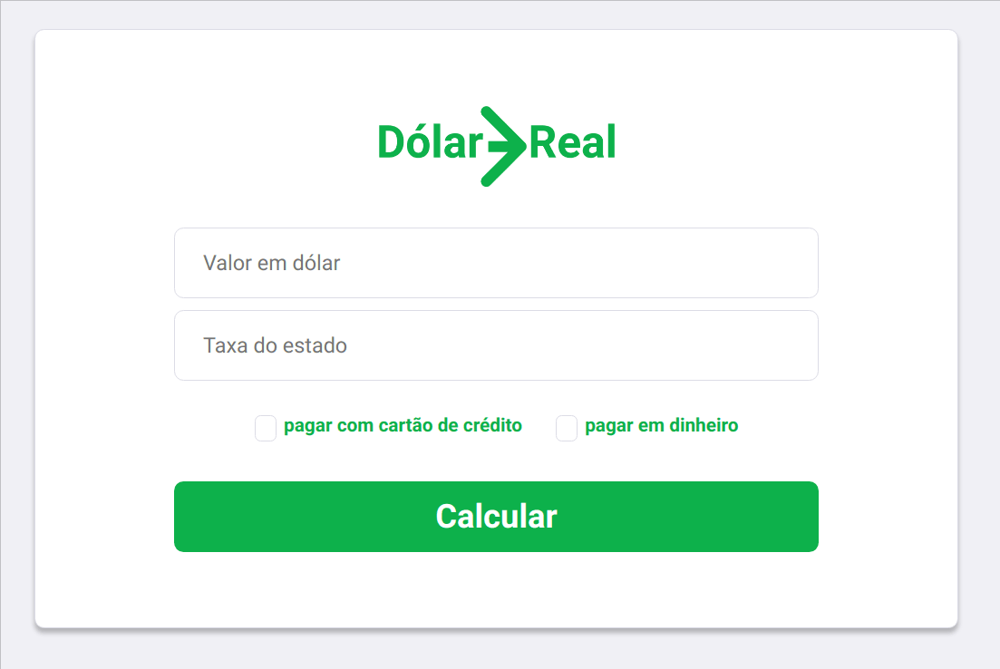

  

#

Aplicação para conversão de valores em dólar para real.

### :tv: Preview 

  

### :books: Used libraries:
#
- React.js
- axios
- react-router-dom
- react-text-mask
- text-mask-addons

### :page_facing_up: To access the application
#

[click here](https://dolartoreal.netlify.com/)

### :computer: Project instructions
#
To start the aplication execute insides root diretory: 

`yarn install`

then

`yarn start`
